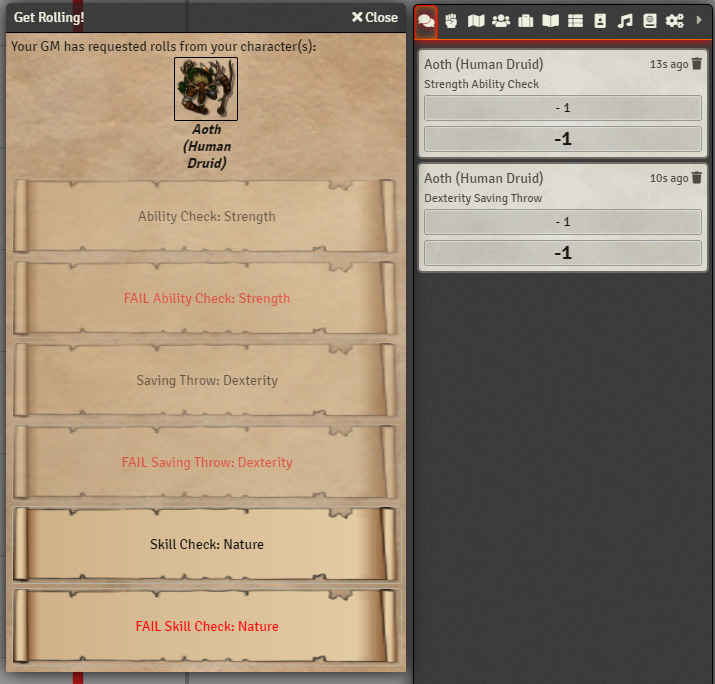

This module was funded by a commission. Donations help fund updates and new modules!

# Fail Rolls - LMRTFY
 
This module adds buttons to intentionally fail ability checks, saving throws, and skill checks to the LMRTFY prompt.

This is especially useful in combination with automated Midi workflows.

